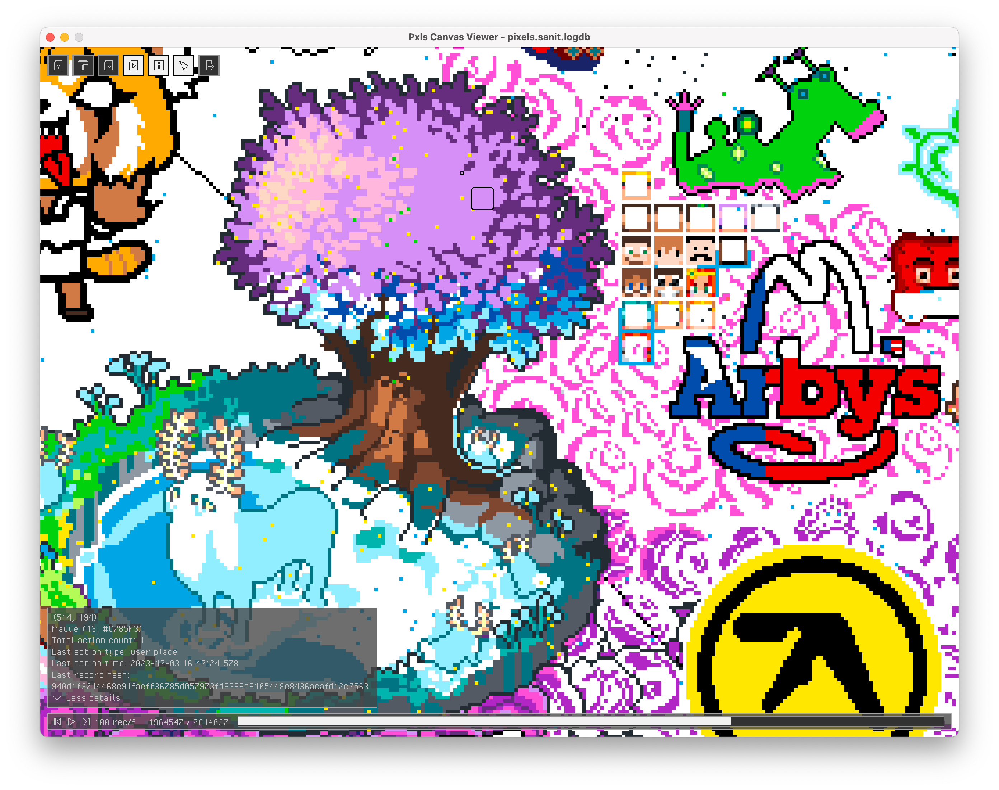

# Pxls canvas viewer

This tool reads a pxls log file and provides an easy-to-use user interface for users to examine the pxls canvas at any moment. It will convert the pxls log file to a SQLite-based database called LogDB when loading for the first time to speed up playback process and improve user experience. After conversion, the next time you want to open that pxls log, you can just open the converted LogDB.



## Usage

Use the toolbar in the upper left corner to load a pxls log/LogDB and palette, or toggle different panels. Use the mouse wheel to zoom in/out, middle button or right button to move around. The panel in the lower left corner shows information about the pixel your mouse cursor points to. The panel in the bottom allows you to control the playback of the canvas, including playback speed and the position of playback head.

## Build instructions

This project requires C/C++ toolchain, CMake, SQLite and Boost to be installed correctly before building.

To build pxls canvas viewer, run:

``````bash
cmake -B build .
cmake --build build
``````

Built executable is in the build folder, called ``pxls-canvas-viewer``. ``style.rgs`` and ``palette.json`` are also needed in order to run the application, which are in the build folder as well.

## LogDB structure

LogDB is a SQLite-based database, which consists of two tables. The first one is log table, which stores not only the data from the original pxls log, but also the record ID of the previous record that manipulates the same pixel as the current record. The second one is canvas_snapshot table, which stores the state of the entire canvas at several positions of playback head in order to improve playback experience.

## License

Pxls canvas viewer is licensed under the [MIT licence](https://opensource.org/licenses/MIT). Please see [the licence file](https://github.com/fadedflower/pxls-canvas-viewer/blob/main/LICENSE) for more information.

## Acknowledgments

[SQLite](https://sqlite.org/) for building and querying LogDB.

[Boost](https://github.com/boostorg/boost) for spliting fields in pxls log lines.

[raylib](https://github.com/raysan5/raylib) and [raygui](https://github.com/raysan5/raygui) for rendering the canvas and GUI.

[nlohmann-json](https://github.com/nlohmann/json) for loading palettes in JSON format.

[HowardHinnant-date](https://github.com/HowardHinnant/date) for parsing date strings.

[tinyfiledialogs](https://sourceforge.net/projects/tinyfiledialogs/) for showing open file dialogs.